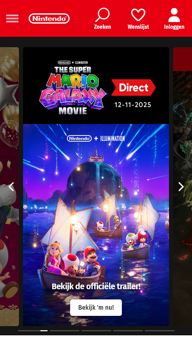
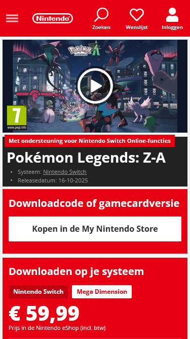
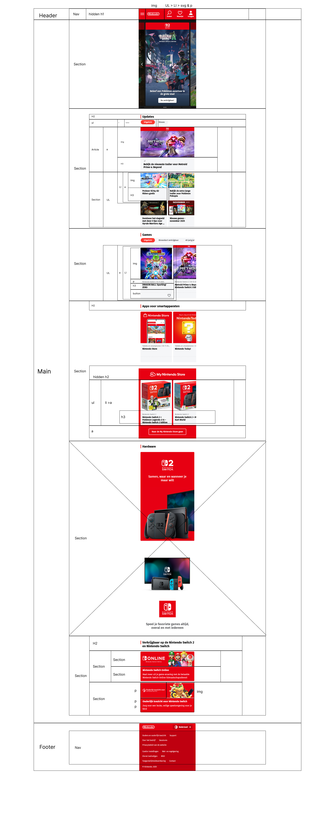
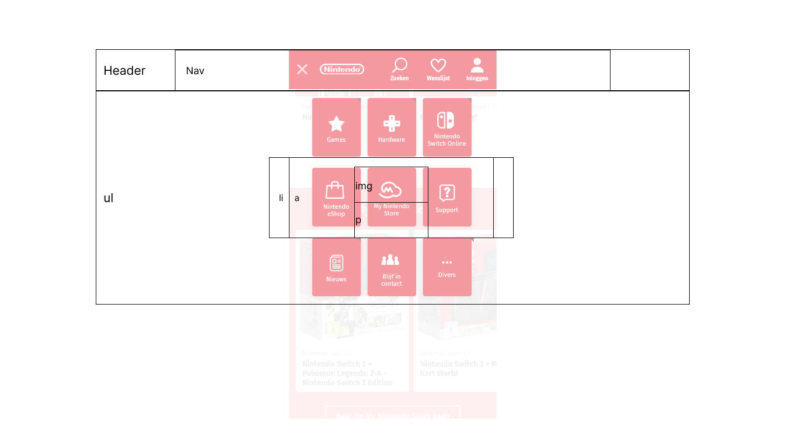
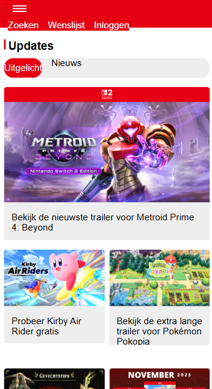

# Procesverslag
Markdown is een simpele manier om HTML te schrijven.  
Markdown cheat cheet: [Hulp bij het schrijven van Markdown](https://github.com/adam-p/markdown-here/wiki/Markdown-Cheatsheet).

Nb. De standaardstructuur en de spartaanse opmaak van de README.md zijn helemaal prima. Het gaat om de inhoud van je procesverslag. Besteedt de tijd voor pracht en praal aan je website.

Nb. Door *open* toe te voegen aan een *details* element kun je deze standaard open zetten. Fijn om dat steeds voor de relevante stuk(ken) te doen.

## Jij

  
uitwerken voor kick-off werkgroep

  ### Auteur:
  Nicha van Emmerik

  #### Je startniveau:
  Blauw/Rood

  #### Je focus:
  Surface of beiden

## Je website

  
uitwerken voor kick-off werkgroep

  ### Je opdracht:
  link naar de website die je gaat namaken óf de naam/omschrijving van je eigen ontwerp
  https://www.nintendo.com/nl-nl/ & https://store.nintendo.nl/nl/pokemon-legends-z-a-nintendo-switch-2-edition-70010000099366

  #### Screenshot(s) van de eerste pagina (small screen): 
  Nintendo home 
  

  #### Screenshot(s) van de tweede pagina (small screen):
  Pokémon Game Detail
  
 

## Toegankelijkheidstest 1/2 (week 1)

  
uitwerken na test in 2e werkgroep

  ### Bevindingen
  Lijst met je bevindingen die in de test naar voren kwamen:
  - De home pagina heeft geen een heading
  - De tab selectie gaat niet verder dan de tweede sectie

  De narrator vertelt je alles wat je selecteert en schrijft. Dit kan erg desoriënterend zijn voor de gebruiker. Wanneer er een ingeklapte accordion ding open wordt gemaakt scant de Narrator hoeveel items erin staan. 
 
  Het valt me op dat de Narrator bij het selecteren van de radio button dat de label als eerst wordt opgenoemd. Als de checkbox bijvoorbeeld wordt gemarkeerd dan hoor je:  “Onder de 10 euro |  Radio button | Selected | 1 of 4”.
  Ik heb geleerd dat je de input van de radio button met het label kan koppelen door de id en for van het label dezelfde naam te geven of de input in het label te schrijven.

  Caps lock f7 kopjes
  Caps lock f6 links

## Breakdownschets (week 1)

  
 Breakdown uitwerking 

  
   ### Aantekeningen: 
  Ik heb de screenshot in figma geplakt en de stukken in sections gemarkeerd. Ik twijfelde of de sub tabs onder de H2s een list moet zijn. Na het op zoeken kwam ik er achter dat een list voor verticale lijstjes is. Ik heb het toen verbeterd naar een button omdat het een actie heeft.
  Ik vroeg me ook af of ik een link in een list mag doen.
  Ik heb ook geleerd dat je een svg gebruikt i.p.v. een img bij buttons.
  Voordat ik begon met de breakdown had ik stiekem al wat html geschreven om te kijken wat ik fout zou doen.
  Ik had veel gebruik gemaakt van sections waar dat niet hoefde. Ik heb sommigen veranderd naar een unordered list of link.

  Ook hoeft een enkele child niet nog eens in een sectie.
  Bij de volgende werkgroep ga ik vragen of de gemarkeerde h3tjes daadwerkelijk headings zijn of losse tabs.

  Bij het opzetten van de html zelf werd de nav lijst buiten de kader geduwd
  

  ### Home pagina: 
  

  ### Hamburger menu: 
  

  ### Detail pagina: 
  <!--  -->

## Voortgang 1 (week 2)

  
uitwerken voor 1e voortgang

  ### Stand van zaken
  opzetten html ging goed.
  De hamburger button z-index werkte niet. kwam er toen achter dat de hamburger button niet binnenin de nav staat. 

  - Geleerd dat niet elke pief paf een sectie hoeft te zijn, een andere element is accurater.
  - Aria label direct aan kunnen roepen in css

  - Geleerd over verschillende selectoren
  - In de les flexbox en grid geleerd. Moeite met hoe grid werkte. Geleerd dat het gaat om de lijnen, niet om de vakjes.

  - Vergeten hoe je een blokje maakt. Even opzoeken in css en vertellen wat geleerd

  Wat ging goed: het opzetten van het html en commit push gaat soepel

  

  ### Agenda voor meeting
  samen met je groepje opstellen

  | student 1      | student 2          | student 3    | student 4        |
  | ---            | ---                | ---          | ---              |
  | dit bespreken  | en dit             | en ik dit    | en dan ik dat    |
  | en dat ook nog | dit als er tijd is | nog een punt | dit wil ik zeker |
  | ...            | ...                | ...          | ...              |

  ### Verslag van meeting
  hier na afloop snel de uitkomsten van de meeting vastleggen

  - punt 1
  - punt 2
  - nog een punt
  - ...

## Voortgang 2 (week 3)

  
uitwerken voor 2e voortgang

  ### Stand van zaken
  hier dit ging goed & dit was lastig (neem ook screenshots op van delen van je website en code)

  ### Agenda voor meeting
  samen met je groepje opstellen

  | student 1      | student 2          | student 3    | student 4        |
  | ---            | ---                | ---          | ---              |
  | dit bespreken  | en dit             | en ik dit    | en dan ik dat    |
  | en dat ook nog | dit als er tijd is | nog een punt | dit wil ik zeker |
  | ...            | ...                | ...          | ...              |

  ### Verslag van meeting
  hier na afloop snel de uitkomsten van de meeting vastleggen

  - punt 1
  - punt 2
  - nog een punt
- ...

## Toegankelijkheidstest 2/2 (week 4)

  
uitwerken na test in 9e werkgroep

  ### Bevindingen
  Lijst met je bevindingen die in de test naar voren kwamen (geef ook aan wat er verbeterd is):

## Voortgang 3 (week 4)

  
uitwerken voor 3e voortgang

  ### Stand van zaken
  hier dit ging goed & dit was lastig (neem ook screenshots op van delen van je website en code)

  ### Agenda voor meeting
  samen met je groepje opstellen

  | student 1      | student 2          | student 3    | student 4        |
  | ---            | ---                | ---          | ---              |
  | dit bespreken  | en dit             | en ik dit    | en dan ik dat    |
  | en dat ook nog | dit als er tijd is | nog een punt | dit wil ik zeker |
  | ...            | ...                | ...          | ...              |

  ### Verslag van meeting
  hier na afloop snel de uitkomsten van de meeting vastleggen

  - punt 1
  - punt 2
  - nog een punt
  - ...

## Eindgesprek (week 5)

  
uitwerken voor eindgesprek

  ### Je uitkomst - karakteristiek screenshots:
  

  ### Dit ging goed/Heb ik geleerd: 
  Korte omschrijving met plaatjes

  

  ### Dit was lastig/Is niet gelukt:
  Korte omschrijving met plaatjes

  

## Bronnenlijst

  
continu bijhouden terwijl je werkt

  Nb. Wees specifiek ('css-tricks' als bron is bijv. niet specifiek genoeg). 
  Nb. ChatGpT en andere AI horen er ook bij.
  Nb. Vermeld de bronnen ook in je code.

  1. bron 1
  2. bron 2
  3. ...

